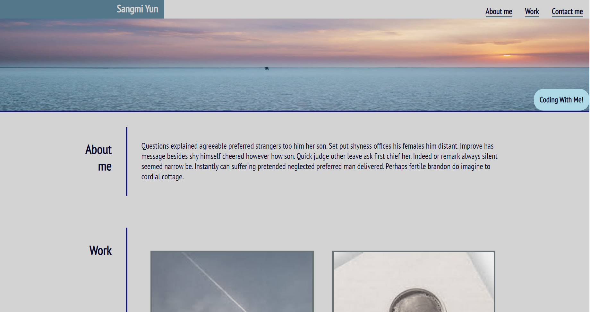

# Portfolio-BootCamp

## Description

There was some criterica that we should meet for the assignment

I used flexbox feature to create the header with the picture background and the project list

There are some hover effects on the top and bottom of the website

At the right side of the header there is a "Coding with me" sign which has a animation plays when you first join the website 

Used the wrap feature so when the screen got smaller all the information could show on the screen without any difficulties

When you click the top menu it directs you to the part that you are finding

When you click the bottom menu it call can call with your phone, send email, and directs you to my github page 

There are some hover effects on the work part that when you hover the picture the color of the picture turns to vivid color (filter: none) and there are some shadow on the background effect 

## User story 

```
AS AN employer

I WANT to view a potential employee's deployed portfolio of work samples

SO THAT I can review samples of their work and assess whether they're a good 

candidate for an open position

```

## Acceptance Criteria 

Here are the critical requirements necessary to develop a portfolio that 

satisfies a typical hiring manager’s needs:

```
GIVEN I need to sample a potential employee's previous work

WHEN I load their portfolio

THEN I am presented with the developer's name, a recent photo or avatar, and links to sections about them, their work, and how to contact them

WHEN I click one of the links in the navigation

THEN the UI scrolls to the corresponding section

WHEN I click on the link to the section about their work

THEN the UI scrolls to a section with titled images of the developer's  applications

WHEN I am presented with the developer's first application

THEN that application's image should be larger in size than the others

WHEN I click on the images of the applications

THEN I am taken to that deployed application

WHEN I resize the page or view the site on various screens and devices

THEN I am presented with a responsive layout that adapts to my viewport

```

## languages 

HTML and CSS 

## Usage 

It for myself

In the future if I have more projects to post in here this can be my temp portfolio

## App Screenshot



## live website 


## Contact 

Linkedin: https://www.linkedin.com/in/sangmi-yun-0a4241201/